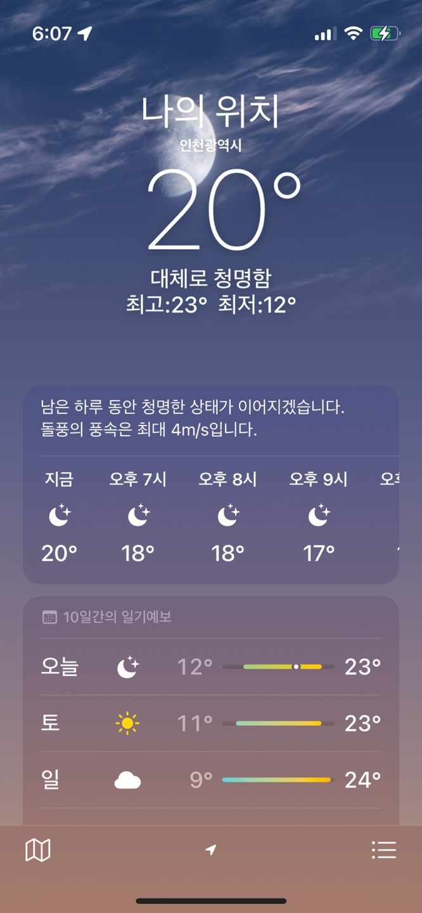
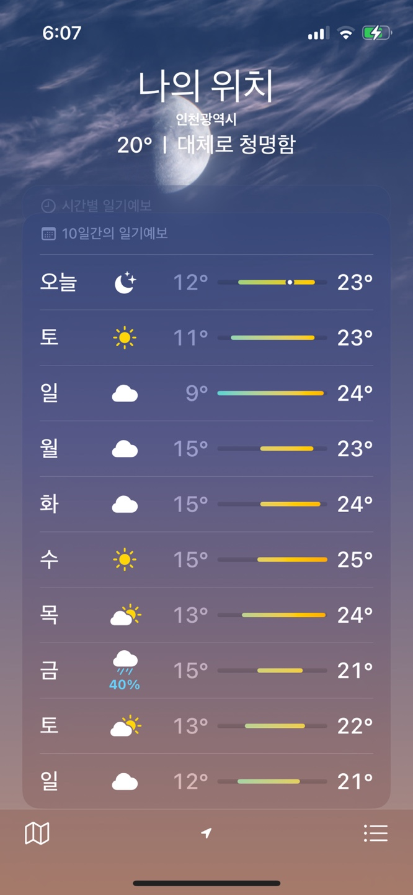
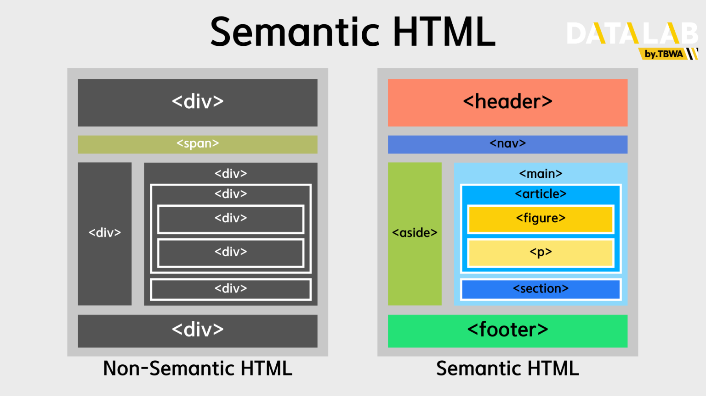

# 1. 아이폰 날씨 어플

## 목표

1. 날씨 API를 이용하여 원하는 도시의 날씨를 검색할 수 있도록 하기
2. 요약 정보로 위치와 기온, 최고 기온, 최저 기온 보여주기
3. 1시간 별 날씨 정보 제공
4. 오늘을 기준으로 4일치 날씨 정보 제공

## 공부

### 1) 클래스 이름이랑 아이디 이름을 어떻게 지을까

BEM이란 클래스의 이름만 보고도 쉽게 이해할 수 있다는 것이 큰 장점!

- Block : 블록
- Element : 요소
- Modifier : 수식어

**Block**  
: 재사용할 수 있는 기능적으로 독립적인 페이지 구성 요소
: Nav, Header, Footer 등이 해당

**Element**  
: 블록 안에서 특정 기능을 담당하는 부분, 그래서 자신이 속한 블록에 의존적
: 예를 들면 block 안에 있는 p, img 등이 있다고 하면 block**p, block**img 이렇게 사용하면 된다.

**Modifier**  
: 블럭 또는 요소의 외형, 상태, 행동을 정의
: 속성값으로 단독 사용이 불가함
: 생긴게 조금 다르거나, 다르게 동작하는 블럭이나 요소를 만들 때 사용
: block--수식어, element--수식어 형태로 사용
: 타입

1. boolean 타입 : 참/거직, 즉 토글되는 두 가지의 상태값이 있을 때 사용 ex) -focused

2. key-value 타입 : 하이픈을 사용해 성질-내용을 표시 ex) theme-normal, color-red

**작명 규칙**

1. 태그, id를 사용하지 않고 class 만 사용
2. 개발, 디버깅, 유지 보수를 위하여 css 선택자의 이름을 가능한 명확하게 만듬
3. 소문자, 숫자 만을 이용해 작명
4. 여러 단어의 조합은 싱글 하이픈으로 연결하여 작명
5. 외형 묘사가 아닌 구조적, 의미적인 이름을 짓는다.

출처) https://velog.io/@gogi7979/HTML-CSS-%EB%84%A4%EC%9D%B4%EB%B0%8D

### 2) html 태그 div 남발 하지 않는 방법

**시맨틱 태그**

시맨틱 태그는 태그에 의미를 부여함으로써 웹사이트의 구조를 파악하기 쉽도록 도와주기 위해 만들어졌다.

**1. header**  
: 문서나 섹션의 머릿글을 지정하며, 로고, 탐색, 제목 및 기타 소개 정보가 포함된 페이지 상단 부분을 정의. 여기에는 메타 태그 정보, 키워드, 심지어 가져온 CSS 파일이나 스타일 시트도 포함되는 경우가 많음

**2. nav**  
: 탐색 링크에 사용되고, header태그와 중첩이 될 수 있지만 보조 탐색 nav 태그도 일반적으로 사용된다

**3. main**  
: 페이지의 본문인 주요 콘텐츠가 포함되어 있어야 하고 페이지당 하나의 태그만 있어야 함. article, aside, footer, header, nav 등 모든 페이지의 태그 앞에 위치

**4. article**  
: 독립적인 글을 다루는데 사용하는 태그. 블로그 게시물, 뉴스기사, 제품리뷰 등등 독립적으로 배포하거나 재사용할 수 있는 독립형 콘텐츠를 정의

**5. section**  
: 태그는 문서의 부분을 의미하는 태그로, 기본 콘텐츠 내의 특정 주제 또는 부제목과 관련된 주제별 콘텐츠 그룹을 정의. section 안에 section을 넣을 수도 있고, article을 이용해 내용을 넣을 수도 있음

**6. aside**  
: 옆에 위치하는 콘텐츠를 담는 태그로, 주로 문서에서 사이드바를 놓기 위해 사용함

**7. details**  
: 사용자가 보거나 숨길 수 있는 추가 세부 정보를 정의하는 태그. 사용자와 상호작용이 가능하고 사용자가 버튼을 통해 열고 닫을 수 있음

**8. figure & figcaption**  
: figure는 일러스트레이션, 다이어그램, 사진, 코드 목록처럼 자체 포함된 콘텐츠를 지정하고, figcaption은 figure 요소에 대한 설명을 추가하기 위해 사용함

**9. footer**  
: 문서 또는 섹션의 바닥글을 지정하고 문서의 맨아래쪽에 위치. 일반적으로 연락처 정보, 사이트 맵, SNS링크 같은걸 추가되는 부분임

출처:  
https://velog.io/@jh0152park/%EC%8B%9C%EB%A7%A8%ED%8B%B1-%ED%83%9C%EA%B7%B8%EB%A5%BC-%EC%95%84%EC%8B%AD%EB%8B%88%EA%B9%8C  
https://seo.tbwakorea.com/blog/what-is-semantic-tag/
